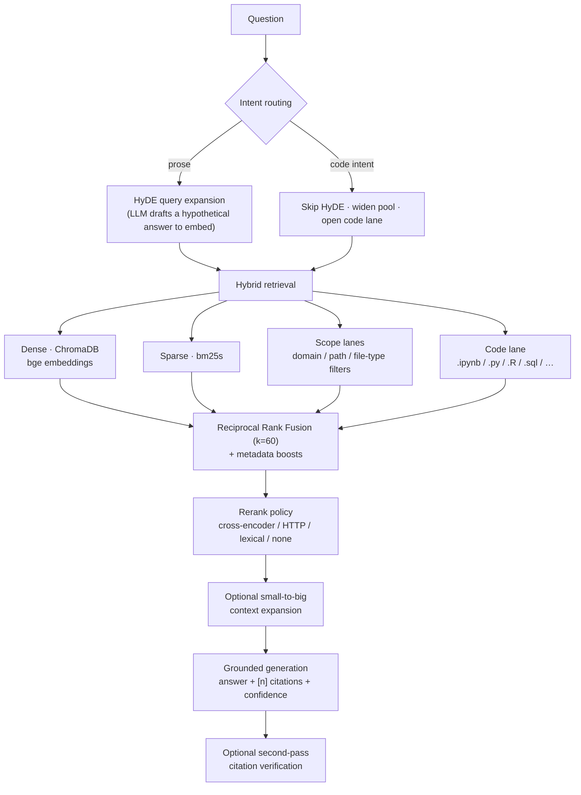

# Noetrix

**Grounded, cited question-answering over your own documents.** Point it at a
folder: a notes vault, a research library, a docs tree, a pile of scanned PDFs.
Ask questions in plain language and answers are assembled *only* from
what you indexed, with inline `[n]` citations and a per-answer confidence line.
When your corpus is silent on something, it says so instead of inventing.

<p>


</p>

> **Runs on free / local infrastructure.** CPU embeddings, on-disk vector and
> sparse indexes, no managed service. Generation is the only part that can be
> remote, and it is one config line: any OpenAI- or Anthropic-compatible
> endpoint — a cloud API, a free-tier proxy, or a model server on your own
> machine. **Retrieval works with no LLM at all.**

---

## Who this is for

You have documents that a general chatbot cannot help you with, because it has
never seen them: internal handbooks, research notes, meeting minutes, a
textbook library, product specs, legal files, lab notebooks, a decade of
personal notes. You want answers that cite the paragraph they came from, so you
can check them.

This is a full retrieval pipeline, not a wrapper around an embedding call:
hybrid retrieval, query expansion, intent-aware scope routing, a dedicated code
lane, cross-encoder reranking, grounded generation with a citation-audit pass, a
management console, an agent-facing HTTP API, and a reproducible evaluation
suite.

It reads Markdown, PDFs (including scanned ones, via OCR), Jupyter/R notebooks,
source code in most languages, and Office documents. Wikilinks and YAML
frontmatter are understood natively, so a Markdown knowledge base drops straight
in, but nothing is required beyond a directory of files.

## How a query flows



Every stage is swappable from `config.yaml`. Solid path = always on; the rest
are optional lanes that open only when the query calls for them.

## What makes retrieval good here

- **Hybrid dense + sparse, fused by RRF.** Dense embeddings catch paraphrase and
  meaning; BM25 catches exact terminology, symbols, identifiers and rare names.
  Reciprocal Rank Fusion combines them with a downstream reranker deciding final
  order — no fragile score normalisation across incompatible scales.
- **Intent-aware scope routing.** A query that names a subject area or a content
  type ("in the compliance policies", "in the textbooks", "the onboarding docs")
  opens *filtered* lanes toward that material. Routing is **soft**: scoped chunks
  get guaranteed seats in the candidate pool, but the reranker still makes the
  final call — a wrong hint degrades gracefully and can never empty your results.
  Both dictionaries are config-only; extend them without touching code.
- **A dedicated code lane.** Code and notebook chunks are usually a small
  fraction of a corpus, so a prose-oriented pipeline buries them under prose that
  merely mentions the keyword. Detecting code intent, skipping HyDE, widening the
  pool and reserving a filtered lane for script/notebook chunks brings real code
  back to the top.
- **Reranking you can choose.** A cross-encoder re-scores the fused candidates
  against the query for precision at the top. The model is swappable, it can run
  on a GPU, out-of-process behind an HTTP endpoint, or be replaced by a
  model-free lexical scorer on hardware that cannot afford one.
  **Bigger is not automatically better on your corpus** — that is what
  `recall@k` and `MRR` in the eval suite are for, and the default stays the
  cheap, portable model until your own numbers say otherwise.
- **Grounded, cited generation** answers from the retrieved excerpts only, emits
  inline `[n]` citations and a confidence line, and can run a second pass that
  verifies each citation actually supports its sentence.

## Tuning without restarts

Named retrieval **presets** live in `config.yaml` and are selectable per query —
the warm pipeline is never mutated:

```yaml
retrieval:
  presets:
    code:      {rerank_top_k: 10, use_hyde: false, dense_top_k: 40, sparse_top_k: 40, boost_code: true}
    concept:   {rerank_top_k: 5,  use_hyde: true}
    synthesis: {rerank_top_k: 10, use_hyde: true, dense_top_k: 30, sparse_top_k: 30}
```

```bash
# CLI
python main.py query "Explain our data retention rules" --preset concept

# Warm HTTP endpoint (no restart, hot pipeline)
curl -s -X POST http://127.0.0.1:8051/query \
     -H "Content-Type: application/json" \
     -d '{"q": "show me a plotting example from my code", "preset": "code", "top_k": 10}'
```

Every response echoes exactly what ran (`retrieval: {preset, rerank_top_k,
hyde_used, …}`), so results are always explainable.

### Say what "best" means

Results can be entirely on-topic and still be the wrong *kind* of thing. A
**rerank instruction** states the ranking criterion in plain language and
applies it after retrieval, so it reorders the pool you already have and can
never remove anything from it:

```bash
curl -s -X POST http://127.0.0.1:8051/search \
  -H "Content-Type: application/json" \
  -d '{"q": "how do I rotate credentials",
       "rerank_instruction": "prefer worked procedures and runnable examples over definitions"}'
```

Set a default in `retrieval.rerank_instruction`, or send it per call. It is
routed per rerank mode and the response echo reports whether it was actually
applied — `lexical` scoring ignores it by design, because folding a sentence of
instruction into a query-term set would dilute the query's own terms.

### Compare runs instead of guessing

`POST /compare` runs a bounded tree of preset, reranker, or provider branches
for one question. Retrieval comparisons report common and unique evidence ids,
rank shifts, and pairwise overlap rather than comparing incompatible raw score
scales. Provider-only branches reuse the exact same evidence, so answer
differences come from generation rather than retrieval noise.

`GET /compare/options` hands you branch objects you can post unchanged, with the
live branch caps and the reason any backend is unavailable — so neither an agent
nor a person has to join `/schema` and `/providers` by hand. In the console the
same thing is a collapsible **Query comparison tree** panel under the composer.

## Two services + a console

| Surface | Port | What it's for |
|---|---|---|
| **Query API** (`serve_api`) | `:8051` | Warm FastAPI endpoint — ask, search, compare, inspect evidence, discover capabilities. `GET /schema` is the live agent contract. |
| **Corpus Ledger console** (`manage_api`) | `:8052` | Visual management: Query, Documents (search / filter / retag / delete), Vault browser, Ingest, Jobs, Settings, and an Info tab that diagrams the whole pipeline in-app. `GET /api/schema` is its machine-readable, permission-tiered capability map. |

Both are documented endpoint by endpoint in the
**[API reference](docs/api.md)** — 13 query endpoints and 38 management
endpoints, every one of them callable by an agent without a browser.

The console's import lane pulls online sources straight into the corpus
pipeline: fetch a URL as **markdown** or as a **printed PDF** of the fully
rendered page (headless Chromium — LaTeX, tables and highlighted code
preserved), preview the result, then promote it into the normal ingest flow.

## Built for agents, not just people

Every capability is reachable over JSON, and both services publish a live
schema so an agent discovers what it may call instead of hard-coding a list
that goes stale:

```bash
curl -s http://127.0.0.1:8051/schema     # query capabilities, presets, limits
curl -s http://127.0.0.1:8052/api/schema # management operations + permission tiers
```

`/search` is the primary agent call: retrieval only, no generation backend
needed, no tokens spent. Management operations carry a `read` / `mutating` /
`destructive` permission tier so a toolkit can gate them before calling.
See **[Agent integration](docs/agents.md)**.

## Evaluation — honest by design

A labelled suite (`eval/golden_queries.yaml`) scored automatically in three
tiers, each one clear about what it can and cannot prove. Every run writes a
JSON result and a markdown scorecard, and **every metric reports the number of
questions it was actually scored over** — a metric with no ground truth reports
`not scored`, never a confident zero.

| Tier | Metrics | Needs |
|---|---|---|
| **1 · Retrieval** | hit-rate@k, **MRR**, **recall@k** over expected source files, **scope precision / recall**, routing accuracy | nothing but the index — runs offline in minutes |
| **2 · Answer** | keyword recall, **citation validity** (`[n]` markers that actually resolve), **groundedness floor**, citation support, answered rate | generation endpoint |
| **3 · Calibration** | correctness bucketed by the answer's own HIGH/MEDIUM/LOW line, plus the HIGH−LOW `gap` | generation endpoint |

The **groundedness floor** is the part worth defending: it is deterministic and
needs no LLM. For each cited sentence it measures content-word n-gram overlap
with the chunk that sentence points at, and reports the worst-scoring sentence
by name. High overlap doesn't prove a claim is right — but *low* overlap means a
sentence barely resembles the source it cites, which is the exact shape of a
fabricated citation. It also catches dangling markers (a `[9]` against a top-7
context), which generators otherwise drop silently.

An optional `--judge` tier adds LLM-as-judge correctness against a `gold_answer`
label, explicitly marked **advisory**: a language model grading a language model
is useful for ranking two runs against each other, not as ground truth — and
when a question has no gold answer the judge's score is *discarded* rather than
recorded.

```bash
python main.py eval --retrieval-only     # tier 1 only: offline, minutes, no LLM
python main.py eval                      # all three tiers
python main.py eval --judge              # + the advisory LLM-judge pass
```

`--judge-export` writes a JSONL bundle (question, answer, and the text of the
chunks the answer actually cited) that any external grader can score;
`--judge-import` merges the scores back and rebuilds every tier. A partial
scores file is refused rather than quietly averaged.

## Swapping the LLM backend

Generation, HyDE and the eval judge each resolve through a **provider registry**
in `config.yaml`, so the backend is a one-word change and different roles can
run on different providers (generate locally, judge with something stronger):

```yaml
providers:
  my_backend:
    kind: openai                       # the wire protocol, not the vendor
    base_url: "https://api.example.com/v1"
    model: "some-model-id"
    api_key_env: MY_BACKEND_API_KEY    # the NAME of the variable, never the key
generation:
  provider: my_backend
```

The shipped registry covers a spread of hosted endpoints and the local runtimes
(Ollama, LM Studio, KoboldCPP) out of the box; anything exposing an
OpenAI-compatible `/v1/chat/completions` or an Anthropic-compatible endpoint
drops in the same way. **Keys are never stored in `config.yaml`** — a provider
names the environment variable that holds its key, and the console's Settings
tab shows which providers have their key set without ever displaying the value.

## Quickstart

```bash
pip install -r requirements.txt
cp .env.example .env                 # add a generation API key (or point at a local server)
cp config.example.yaml config.yaml
# edit config.yaml: parser.vault_path -> your documents folder

# 1. Parse markdown notes -> data/chunks.jsonl
python -m src.ingestion.obsidian_parser "path/to/your/notes" -o data/chunks.jsonl

# 2. Build the dense + sparse indexes
python main.py index

# 3. (optional) add PDFs, notebooks, and code, then append
python main.py ingest-pdfs                       # -> data/pdf_chunks.jsonl
python main.py ingest-notebooks                  # -> data/ipynb_chunks.jsonl
python main.py ingest-code --include-path "src"  # -> data/code_chunks.jsonl
python main.py index --append data/pdf_chunks.jsonl

# 4. Ask
python main.py query "What does our incident response process require?"
python main.py chat                              # interactive REPL

# 5. Serve
python -m uvicorn serve_api:app --host 127.0.0.1 --port 8051   # warm JSON API
python -m uvicorn manage_api:app --host 127.0.0.1 --port 8052  # Corpus Ledger console

# 6. Measure
python main.py eval --retrieval-only             # fast offline regression
```

Full local-only setup (no cloud key) is in [`RUN_LOCAL.md`](RUN_LOCAL.md);
day-to-day usage is in [`MANUAL.md`](MANUAL.md); the **documentation site**
(architecture, API reference, agent integration, operations, Docker) is under
[`docs/`](docs/) and builds with MkDocs:

```bash
pip install mkdocs-material
mkdocs serve        # http://127.0.0.1:8000
```

## Run it anywhere with Docker

Docker deployment uses the separately packaged `rag-docker-bundle` tree, which
contains the Compose file, Dockerfile, container config, and this source under
`app/`. A plain source clone does not contain that scaffold. Once unpacked, it
runs both services plus a generation backend with **two commands** — no Python
or venv setup:

```bash
docker compose up --build -d     # query API :8051 · console :8052 · generation :3001
```

Two heavy extras are **opt-in and independently stoppable**, so a laptop can
reclaim their memory when they are idle:

```bash
docker compose --profile ocr    up -d --build paddleocr   # PaddleOCR for scanned PDFs
docker compose --profile rerank up -d rerank              # external reranker on /v1/rerank
docker compose stop paddleocr                             # give the RAM back
```

On a machine with an NVIDIA GPU, [`ocr-sidecar/`](ocr-sidecar/) holds the same
OCR sidecar built against CUDA and PaddleOCR 3.x, as its **own** compose
project — same port, same contract, but the recognition models live in VRAM
instead of system RAM, and its lifecycle is independent of the query stack:

```bash
cd ocr-sidecar && docker compose -f docker-compose.gpu.yml up -d --build
```

See [`docs/deployment-docker.md`](docs/deployment-docker.md) for the full
walkthrough.

## Repository layout

```
config.yaml / config.example.yaml   # every tunable: providers, top-k, presets, paths, routing
ocr-sidecar/                        # the OCR sidecar's source: one server.py, CPU + GPU images
.env.example                        # secrets template (real .env is gitignored)
main.py                             # CLI: index | ingest-* | query | chat | eval | serve
serve_api.py                        # warm query API (:8051)
manage_api.py                       # Corpus Ledger console backend (:8052)
webui/index.html                    # the console front-end
app.py                              # optional Streamlit interface
src/
  ingestion/   # obsidian_parser, pdf_loader (OCR-capable), ipynb_loader, code_loader,
               # ocr_vlm (vision-model OCR), ocr_paddle (PaddleOCR sidecar), web_import
  embeddings/  # embedder — builds ChromaDB + bm25s from chunk JSONL
  retrieval/   # retriever (hybrid + RRF + code lane), reranker, hyde, scope, context_expand
  generation/  # generator — grounded answers + citation verification
  llm/         # unified OpenAI-/Anthropic-compatible client
  prompts/     # versioned YAML prompt templates + loader
  utils/       # config_loader (comment-preserving persistence), logger
  pipeline.py  # wires the query path together
eval/          # golden suite, tiered runner + pure metric layer (metrics.py)
tests/         # pytest suite
docs/          # MkDocs documentation site
```

## Design notes

- **Content-addressed IDs.** `doc_id = sha256(source_file + text[:500])[:16]` —
  re-ingesting is idempotent; changing chunk *text* orphans vectors (there's a
  swap playbook for that), while metadata-only fixes go through an in-place
  retag with no re-embedding.
- **JSONL is the source of truth**; the vector DB and the sparse index are
  *derived* and rebuildable from it. Readers stream and split on `"\n"` only, so
  exotic Unicode inside chunk text can never shred a record.
- **Paged maintenance.** Every scan/update/delete pages the vector store in
  bounded batches, so maintenance stays within a modest RAM budget at any corpus
  size.
- **Failures are reported, never hidden.** If the generation endpoint is down the
  API returns a readable error object (not a 500) and retrieval still works; if
  the pipeline cannot be built at all, `/health` says so with the reason and
  every query answers 503 with the same text instead of a bare refusal.

Deliberately **not** implemented: weighted RRF. It was evaluated and skipped —
the downstream cross-encoder already absorbs the benefit once the right chunks
are in the pool, and per-lane weights only re-introduce a tuning burden for
gains within noise.

## License & credits

Built by [Albert Hakobyan](https://AlbertHakobyan.us.kg).
Project site: **[the landing page](landing/index.html)** ·
Docs: **[MkDocs site](docs/)** ·
Source: **[GitHub](https://github.com/AlbertHakobyan070/Advanced-Obsidian-RAG)**
