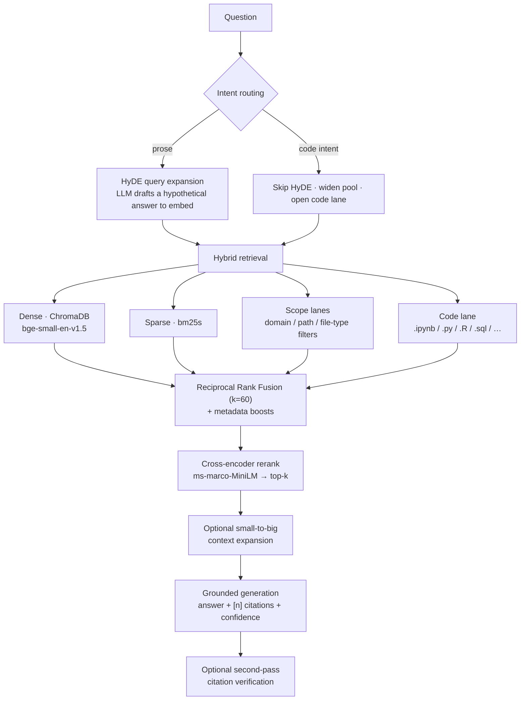

# Architecture

Every stage below is configured from `config.yaml` and can be swapped, tuned, or
turned off. Solid paths are always on; optional lanes open only when a query calls for
them.

## The query path

## Ingestion

The index is built from JSONL chunk files, one per source family. Each loader
normalises its inputs into the same chunk schema (text + metadata: `source_file`,
`domain`, `course`, `file_type`, `has_code`, `wikilinks`, …):

| Loader | Handles |
|---|---|
| `obsidian_parser` | Markdown notes; heading-aware sectioning; course / domain tagging (configurable taxonomy); wikilink capture. |
| `pdf_loader` | Lecture PDFs and textbooks; OCR-capable for scanned pages. |
| `ipynb_loader` | Jupyter and R notebooks (`.ipynb`, `.R`, `.Rmd`, `.py`). |
| `code_loader` | Other source languages (`.js/.ts/.sql/.go/.java/.c/.cpp/.rs/.sh/…`) into a dedicated code lane. |
| `ocr_vlm` | Vision-model OCR path for hard scanned material. |

!!! note "Selectable chunking"
    Oversized sections can be split by **`heading`** (the default — respects document
    structure and wins on well-structured PDFs) or **`fixed`** (a sliding window, better
    for OCR walls of text with no paragraph breaks). Choose per run with
    `--chunking heading|fixed`.

## Hybrid retrieval

- **Dense** — sentence embeddings (bge-small-en-v1.5) in ChromaDB capture meaning and
  paraphrase.
- **Sparse** — BM25 (`bm25s`) captures exact terminology, symbols, rare names, and code
  tokens that embeddings blur.
- **Fusion** — the two ranked lists are combined by **Reciprocal Rank Fusion**:

    $$\text{RRF}(d) = \sum_{\ell \in \text{lanes}} \frac{1}{k + r_\ell(d)}, \quad k = 60$$

    where $r_\ell(d)$ is document $d$'s rank in lane $\ell$. RRF needs no score
    normalisation across incompatible scales, and $k=60$ damps the influence of any one
    lane's top ranks so a single list can't dominate.

!!! info "Why fusion is unweighted"
    Per-lane weights (`w_ℓ / (k + r)`) were evaluated and **deliberately skipped**. The
    downstream cross-encoder already decides final order once the right chunks are in
    the pool — weighting only re-introduces a tuning burden for gains inside the noise.

## Scope routing

Queries that name a domain or content type are routed toward where they point:

- `retrieval.domain_signals` maps aliases (e.g. "BI", "DataViz", "pytorch") to
  `domain` metadata values.
- `retrieval.content_signals` maps phrases (e.g. "lecture files", "tech books",
  "cheat sheet") to path substrings or file types.

A detected scope adds **filtered dense + sparse lanes** to the fusion. Routing
is **soft**: in-scope chunks are guaranteed seats in the candidate pool, but
the reranker still makes the final call — so a wrong hint degrades gracefully
instead of returning nothing. Both dictionaries are config-only; extend them
without touching code.

## The code lane

Code and notebook chunks are a small slice of the corpus. For a query like
*"show me a complex ggplot from my code"*, a prose-oriented pipeline writes a
prose HyDE draft that lands near lecture notes, and BM25's code hits get
outvoted in fusion by textbook pages that merely repeat the keyword — so the
reranker never even sees the user's own code.

The fix, triggered by a configurable code-intent signal list:

1. **Skip HyDE** (a prose hypothetical hurts code retrieval).
2. **Widen** the dense/sparse candidate pool.
3. **Reserve a filtered lane** for script/notebook chunks so they always reach the
   reranker.

Concept queries are untouched; code queries get their own material back at the top.

## Reranking and context expansion

The fused candidates are re-scored by a **cross-encoder** (`ms-marco-MiniLM`) that reads
the query and each candidate together — far more precise than the first-stage vector
similarity — and the top-k survive. An optional **small-to-big** step then expands each
survivor with its surrounding parent context before generation, trading a little
prompt length for completeness.

## Grounded generation

The generator answers from the retrieved excerpts **only**, emits inline `[n]`
citations and a confidence line, and can run a **second pass** that checks each citation
actually supports the sentence it's attached to. If the generation endpoint is
unavailable, the API returns a readable error object rather than a 500, and
retrieval-only continues to work.

## Serving

Two FastAPI services, designed to run side by side:

- **`serve_api` (`:8051`)** — the warm query endpoint (`/query`, `/search`, `/config`).
  It loads the indexes and models once at startup and stays hot.
- **`manage_api` (`:8052`)** — the **Corpus Ledger** console backend: browse, retag, and
  delete documents; run ingest and maintenance jobs; and an in-app **Info** tab that
  draws this pipeline with a query/ingestion toggle.
